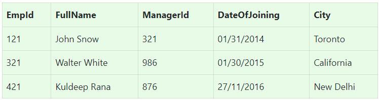
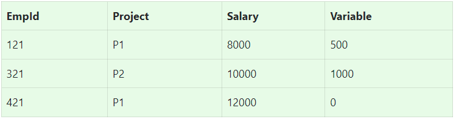

## SQL test

Let's imagine you have two tables below:

### Table – EmployeeDetails

### Table – EmployeeSalary

## Tasks:

1. Write an SQL query to fetch the `EmpId` and `FullName` of all the employees which `FullName` includes character `e`.
2. Write an SQL query to fetch the count of employees working in project `P1`.
3. Write an SQL query to find the maximum, minimum, and average salary of the employees.
4. Write an SQL query to find the employee id whose salary lies in the range of `8500` and `14200`.
5. Write an SQL query to fetch those employees who live in `California` and work under manager with `ManagerId` – 986.
6. Write an SQL query to fetch all those employees who work on Project other than `P1`.
7. Write a query to fetch only the first name(string before space) from the `FullName` column of the `EmployeeDetails` table.
8. Write an SQL query to upper case the name of the employee and lower case the city values.
9. Write an SQL query to find the current date-time.
10. Write an SQL query to fetch all the Employees details who joined in the Year 2015.
11. Write an SQL query to fetch number of employees by every project sorted by employees count by project in descending order.
12. Write an SQL query to fetch top `N` rows?
13. Write an SQL query to find the 3rd lowest salary from a table.
14. Write an SQL query to get Employee name (only name) and salary.
15. Write an SQL query to get all employee details who joined on the first day of any month between `2015` and `2020` years.
